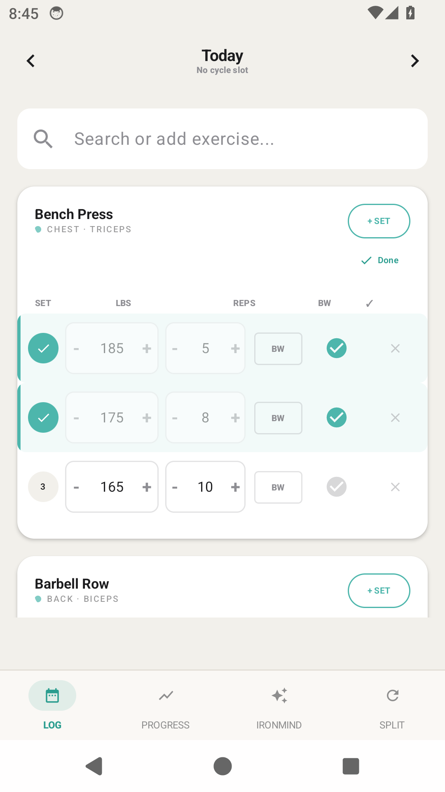
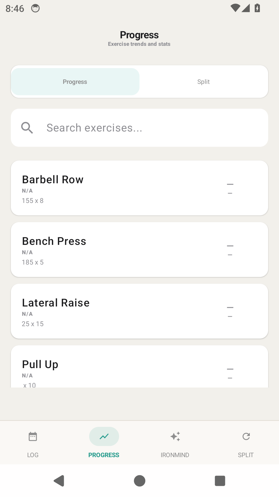
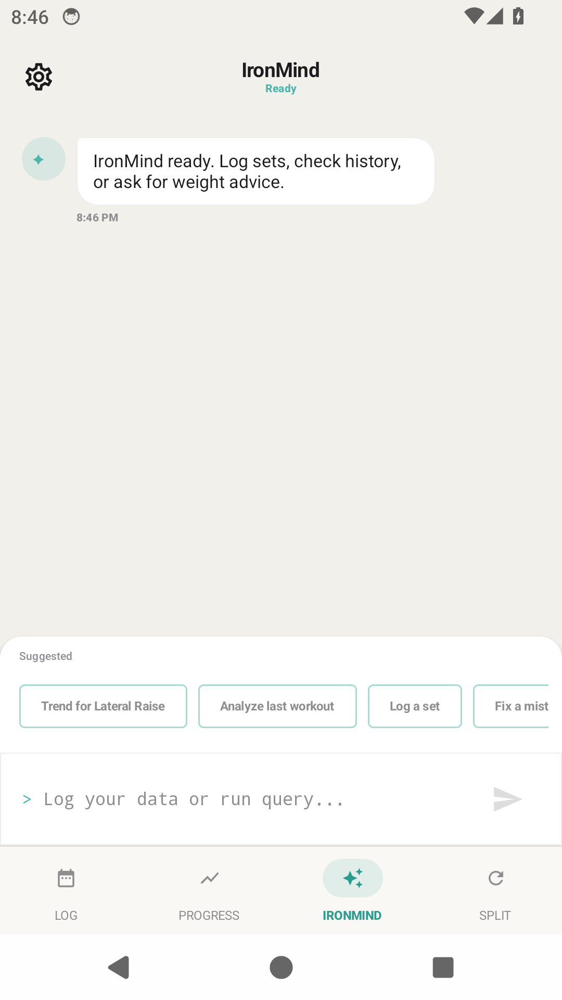

# EcoLift

[](https://github.com/AymanCode/AI-LIfting-App/actions/workflows/android-ci.yml)

EcoLift is a local-first Android workout tracker built with Kotlin, Jetpack Compose, and Room. It supports quick workout logging, split planning, progress review, backups, and natural-language workout edits through an assistant called IronMind.

The app is designed around a practical constraint: workout data should stay useful and recoverable even when AI is unavailable or uncertain. Common assistant requests run through deterministic Kotlin paths first, model output is converted into typed patches, and uncertain logs are preserved as editable drafts instead of being discarded.

**Status:** active personal project and prototype. It is not a Play Store production release.

## Contents

- [Screenshots](#screenshots)
- [Engineering Approach](#engineering-approach)
- [Features](#features)
- [Tech Stack](#tech-stack)
- [Code Map](#code-map)
- [Getting Started](#getting-started)
- [Testing](#testing)
- [IronMind Assistant](#ironmind-assistant)
- [Analytics](#analytics)
- [Project Structure](#project-structure)
- [Documentation](#documentation)
- [Roadmap](#roadmap)
- [Contributing](#contributing)
- [Support](#support)
- [License](#license)

## Screenshots

Screenshots are from a debug build running on an Android emulator with local sample workout data.

| Workout log | Progress | IronMind |
| --- | --- | --- |
|  |  |  |

## Engineering Approach

EcoLift keeps the core workout experience local and predictable. Room owns the workout history, split state, backups, audit rows, and assistant turn logs. Migrations are exported through schema version 13 and covered by migration tests so database changes stay reviewable.

IronMind is an assistant layer around the app, not a database writer. Natural-language requests are routed through deterministic Kotlin paths where possible, and any assistant write is represented as a typed `DbPatch`. Patches are validated before apply, destructive actions require confirmation, and successful writes are recorded with inverse patches for undo.

The project also includes local evaluation and analytics paths. Assistant behavior is measured with JSONL prompt banks, and backup exports can be loaded into DuckDB for workout and agent-quality queries.

## Features

- Mobile-first workout logging for exercises, sets, reps, weights, completion state, and rest timing.
- Exercise search with fuzzy matching, quick-add behavior, and completed-set history.
- Plain-text workout import for historical logs, including mixed formats such as `135x8`, `135 lb x 8`, and `135 for 8 8 6`.
- Split routine management with cycle slots, custom ordering, saved exercises, and suggested next sessions.
- Progress views with exercise history, trend summaries, estimated strength metrics, sparklines, and detailed set history.
- Local backup and restore for workout data, split data, audit rows, pending review rows, and agent turns.
- DuckDB analytics pipeline for querying exported backups outside the app.

## Tech Stack

- Kotlin, Coroutines, StateFlow
- Jetpack Compose, Material 3, Navigation Compose
- Room with exported schemas and migrations through version 13
- MVVM-style ViewModels with repository and DAO boundaries
- MediaPipe GenAI and Android AICore integration points
- JUnit, Mockito Kotlin, AndroidX Test, Room migration testing
- Python and DuckDB for local analytics
- GitHub Actions for unit tests and debug APK builds

## Code Map

Useful starting points if you want to understand how the app is put together:

- [AppDatabase.kt](src/main/java/com/ayman/ecolift/data/AppDatabase.kt): Room database setup, asset seed, migration wiring, and backup scheduling.
- [Migrations.kt](src/main/java/com/ayman/ecolift/data/Migrations.kt): schema evolution and migration definitions.
- [DataBackupManager.kt](src/main/java/com/ayman/ecolift/data/DataBackupManager.kt): local backup, restore, and snapshot handling.
- [AgentOrchestrator.kt](src/main/java/com/ayman/ecolift/agent/AgentOrchestrator.kt): IronMind request routing, deterministic parsing, model fallback, and response handling.
- [DbPatch.kt](src/main/java/com/ayman/ecolift/agent/model/DbPatch.kt), [PatchValidator.kt](src/main/java/com/ayman/ecolift/agent/patches/PatchValidator.kt), and [PatchService.kt](src/main/java/com/ayman/ecolift/agent/patches/PatchService.kt): typed assistant mutation pipeline.
- [InverseComputer.kt](src/main/java/com/ayman/ecolift/agent/patches/InverseComputer.kt): inverse patch generation for undo.
- [LogViewModel.kt](src/main/java/com/ayman/ecolift/ui/viewmodel/LogViewModel.kt) and [ProgressViewModel.kt](src/main/java/com/ayman/ecolift/ui/viewmodel/ProgressViewModel.kt): UI state, workout calculations, and data coordination.
- [docs/TESTING.md](docs/TESTING.md): verification commands, CI behavior, current coverage, and known gaps.

## Getting Started

### Requirements

- Android Studio or Android SDK
- JDK 17
- Android SDK 35
- Python 3.11 or newer for analytics tests

### Run the App

Clone the repository:

```powershell
git clone https://github.com/AymanCode/AI-LIfting-App.git
cd AI-LIfting-App
```

Open the project in Android Studio, let Gradle sync, then run the `debug` variant on an emulator or physical Android device.

From the terminal, build or install the debug app with:

```powershell
.\gradlew.bat assembleDebug
.\gradlew.bat installDebug
```

The debug APK is written under `build/outputs/apk/debug/`.

### Local Configuration

Do not commit local settings or model files:

- `local.properties`
- `.env`
- model files such as `.task`, `.bin`, `.gguf`, or `.litertlm`

Most app functionality is local. Provider keys are only for local development and opt-in live assistant evals. `AI_RESCUE_EVAL_API_KEY` or `GROQ_API_KEY` can provide a key from the shell environment for debug builds, and release builds always blank the Groq key field. A production version should route cloud model calls through a backend proxy rather than shipping a provider key in the client.

Release APKs are unsigned unless all release signing inputs are supplied from local Gradle properties or environment variables: `RELEASE_STORE_FILE`, `RELEASE_STORE_PASSWORD`, `RELEASE_KEY_ALIAS`, and `RELEASE_KEY_PASSWORD`. Do not commit release signing files or passwords.

Debug builds use the checked-in `.android/debug.keystore` only as a public debug/CI signer so update-compatibility tests have a stable certificate. Never reuse it for production or Play Store releases.

## Testing

Run the core Android verification commands:

```powershell
.\gradlew.bat testDebugUnitTest
.\gradlew.bat assembleDebug
```

Run Android instrumentation tests on an emulator or physical device:

```powershell
.\gradlew.bat connectedDebugAndroidTest
```

Run the DuckDB analytics test:

```powershell
python -m pip install -r analytics\requirements.txt
python -m unittest analytics.test_load_backup
```

The full testing guide, live AI rescue eval commands, CI details, coverage notes, and pre-push checklist are in [docs/TESTING.md](docs/TESTING.md).

## IronMind Assistant

IronMind handles workout requests that are slow or error-prone to do manually, especially historical edits, text imports, and workout questions. Example requests:

- `yesterday calf raises 90 for 12 10 8`
- `i did bench press 135x7,125x10,85x5`
- `for last saturday my deadlift top set should say three fifteen for four not 275`
- `delete the extra squat set from May 10`
- `what should I use on incline dumbbell press if bench is 185x5`

The assistant can classify intent, ground requests against local workout data, and propose typed database patches. It cannot write arbitrary SQL or mutate Room tables directly.

```text
user text
  -> deterministic intent routing
  -> optional model fallback for ambiguous language
  -> local data grounding
  -> typed DbPatch generation
  -> validation
  -> confirmation gate for destructive actions
  -> transactional Room apply
  -> audit log and undo
```

Safety controls include typed patch validation, destructive-action confirmation, Room transactions, audit rows with inverse patches, one-tap undo, and recoverable draft cards when a request cannot be safely parsed.

### Agent Evaluation

The agent is tested with JSONL prompt banks instead of relying only on manual demos:

- `ironmind_eval_cases.jsonl`: 200 offline cases for routing, intent accuracy, fallback behavior, patch-field accuracy, and destructive safety.
- `ironmind_realistic_prompt_bank.jsonl`: 120 realistic prompts for messy historical logs, dated imports, corrections, destructive requests, ambiguous rows, and read-only questions.
- `ironmind_ai_rescue_cases.jsonl`: 24 hard prompts for opt-in live model rescue.

Recent local eval snapshots reported 99.5% offline intent accuracy, 87.5% deterministic realistic-bank coverage, and 24/24 successful live rescue cases with no unsafe silent mutations. Regenerate the reports before relying on those numbers.

## Analytics

The `analytics/` folder contains a DuckDB loader for backup exports. It turns local backup JSON into queryable fact and dimension tables:

- `dim_exercise`
- `dim_date`
- `fact_workout_set`
- `fact_split_assignment`
- `fact_agent_turn`
- `fact_patch_audit`

Views cover weekly volume, personal records, workout adherence, undo rate, agent error rate, and data-quality issues.

## Project Structure

```text
src/main/java/com/ayman/ecolift
  agent/      IronMind routing, tools, patches, audit, undo, and local GenAI interfaces
  ai/         Legacy and model-integration helpers retained for current wiring
  data/       Room entities, DAOs, repositories, migrations, backups, and fuzzy matching
  ui/         Compose entry point, navigation screens, theme, and ViewModels

src/test/java/com/ayman/ecolift
  agent/      Router, orchestrator, patch, recommendation, and eval tests
  data/       Fuzzy matcher tests
  ui/         ViewModel and navigation tests

src/androidTest/java/com/ayman/ecolift
  data/       Room migration and backup round-trip instrumentation tests

analytics/    DuckDB loader, sample backup fixture, and pipeline tests
schemas/      Exported Room schemas
docs/         Architecture, testing, and implementation docs
```

## Documentation

- [Project summary](docs/PORTFOLIO.md)
- [Architecture](docs/ARCHITECTURE.md)
- [Testing](docs/TESTING.md)
- [Agent implementation notes](docs/agent/phase_1.md)

## Roadmap

- Add Compose UI tests for the primary log, progress, split, and IronMind flows.
- Add a real-device smoke test for local/on-device AI behavior with a model installed.
- Keep live AI rescue evals opt-in so provider quota is spent intentionally.
- Continue tightening assistant recovery UX for ambiguous imported workout text.

## Contributing

Issues and pull requests are welcome for bugs, docs, tests, and focused UX improvements. Before opening a PR, run the core verification commands from [docs/TESTING.md](docs/TESTING.md) and check `git status --short` for local artifacts.

## Support

Open a GitHub issue for reproducible bugs or setup problems. For implementation details, start with [docs/ARCHITECTURE.md](docs/ARCHITECTURE.md) and [docs/TESTING.md](docs/TESTING.md).

## License

No open-source license has been selected yet. Until a `LICENSE` file is added, treat this repository as source-available only.
